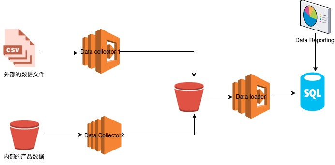

# 微服务构架下的Serveless实践
目前在软件构架下，什么样的构架方式是最受关注的？答案自然是微服务了。似乎人人都在谈微服务，维护老系统的开发人员，在思考如何将系统迁移到微服务的构架下。开发新项目的，现在自热而然已经在开始的构架设计上，已经采用微服务的构架方式了。网络上讨论微服务的文章现在是汗牛充栋，这篇文章不打算更多的讨论什么是微服务，它好处，它的问题，而想讨论下我们在微服务构架下实现上一些演进的方式，希望能带来更多的思考。

## 微服务构架下的数据处理业务
在互联网应用下，数据越来越成为驱动业务的一个重要的驱动力了。CEO要需要依靠数据来做出战略的决定，运营人员需要看数据来做出运营方法，开发人员需要更加交互数据来调整开发的方案。所以可以说数据处理服务慢慢的成为一个企业IT系统中的重要环节。笔者之前参与的项目就为了开发出这样一套数据的ETL系统，为企业的业务人员服务。

具体来说，我们使用了第三方的用户数据追踪服务，来为我们追踪用户的行为，而每天他们都会为我们提供一份用户行为的数据文件，我们需要拿到这些数据，加上我们自己的产品数据，就能清楚的让我们的运营人员看到，我们有哪些产品是最受欢迎的，哪哪些产品的访问量较低等等。那么最初我们是怎么设计的技术方案的呢？

### 传统的微服务架构

我们最初的设计方案是这样的。

我们将业务拆分为3个独立的微服务，2个data collector，1个data loader， 都分别的部署在EC2的Instance上，将中间数据存储在一个外部的S3 bucket上（AWS的数据存储）最后将数据保存在我们的数据库中，在数据库之上我们使用专门的BI工具来制作Report。至于为什么这样拆分微服务，这样拆分的好处是什么，这篇文章这不进行详细的讨论。我们第一个数据服务就是按照这样的构架进行设计和实践的。当系统上线服务以后，我们发现了里边的一些问题。

问题1：资源的浪费。

在我们这套系统中，Data Collector 2 每天的执行时间较长需要1个小时左右的时间，而 Data Collector 1 每天的执行时间较短，通常执行时间不会超过1分钟，但是由于外边的数据源的更新时间是不确定的，所以虽然我们服务实际的有用时间只有仅仅的一到两分钟，但是也不得不让instance24小时全天运行。

可以看到，我们的服务每天实际有效的时间只有一个小时，其他23个小时实际上是在浪费资源，如何改善这样的情况呢？首先我们想到了让服务定点运行的方法。由于我们外服数据源的更新特点，虽然它的更新时间是不确定的，但是它在一个特定的时间点前是一定会更新的。所以基于这样的情况，我们将服务的运行时间改为定点运行，这样是不是就能解决问题了呢？

然而现实总不是那么美好，因为我们服务间是有依赖关系的，data loader 是依赖于我们data Collector的处理结果的，当我们把运行方式改为定点运行后，带来的问题是，一旦data Collector的运行状态出现了问题，例如运行时间过长，运行中出现错误，那么data loader必然出错。并且改为定点运行后，我们的数据更新必然有延迟。

那么如何解决这些问题呢？

### Severless的系统架构
2016年Serveless Architectures的提出引发了对于软件构建的关注，那么什么是Serveless Architectures呢？现在还没有一个明确的定义，但是就我的理解而言，Serveless顾名思义，就是没有Serve的构架方式。我们业务逻辑代码并不是执行在一个Server上了，例如一台EC2的instance。而是运行在一些基于事件驱动的，无状态的第三方计算服务上，也就是Function as a Service。概念可能比较抽象，举例来说就是AWS的Lambda，Lamnda可是说是Function as a Service的典型代表。那么下边我就来介绍下，我们是如何使用Lambda来改进上边的数据处理系统。

其实也很简单，我们将Data Collector 和 Data loader用Lambda进行了替换，有哪些好处呢？第一点因为我们的基础架构是架构在AWS上的所以，Lambda提供了很多事件驱动的机制，例如，S3上一个数据的变化可以触发一个事件，SNS的一条消息可以触发一个时间等等，在使用Lambda后，我们就可以讲原来基于事件的数据处理流程，转变为基于事件的数据处理流程，这样一方面可以保证我们数据更新的实时性，另一方面可以大大节省资源，由于Lambda是按照触发次数收费的，所以在我们的这个用例下，可以大大减少花费。可能细心的读者想问为什么我们data Collector 2 没有使用Lambda进行替换呢？这是因为它的业务逻辑比较复杂，每次运行的时间较长，而Lambda的最长执行时间是5分钟，所以在这种情况下，就不适合使用Lambda进行替换了。

1.微服务下的挑战 什么是serveless
2.构建演化 - job
3. apigateway + lambda - 监控，logging
4，总结